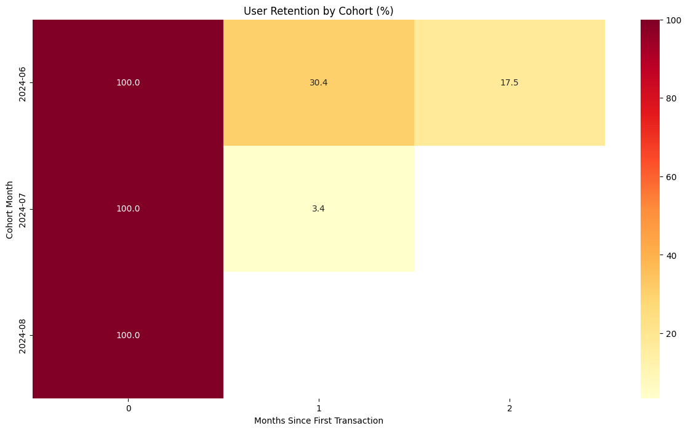
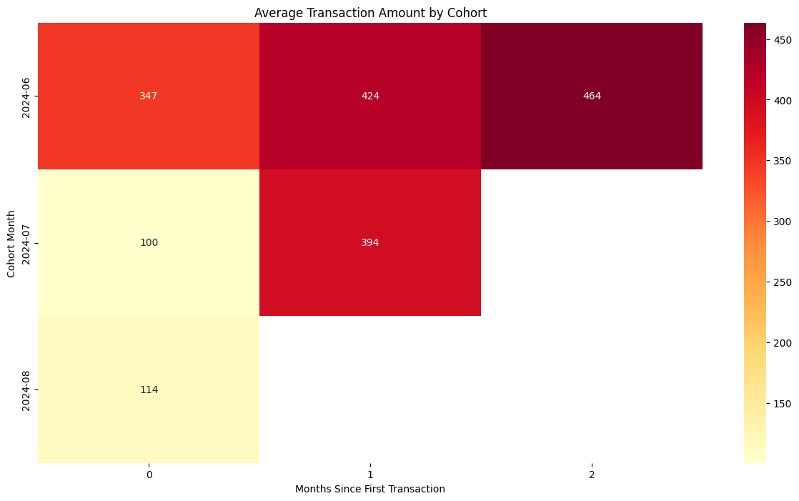
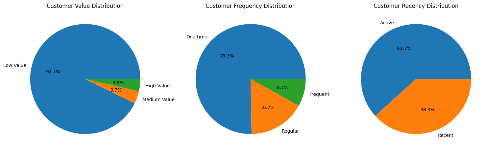
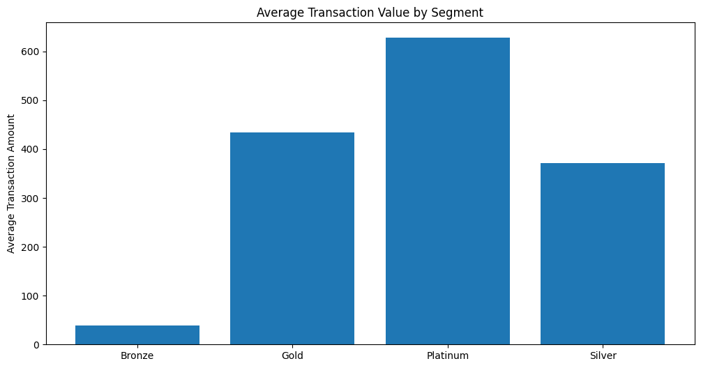

# Guruji Astro Deep Analysis Project

## 📊 Project Overview

A comprehensive data analysis of the Guruji Astro platform's transaction data and user interactions for June-July 2024. This analysis provides insights into user behavior, transaction patterns, and platform performance metrics.

## 🎯 Key Objectives

- Analyze transaction patterns and user behavior
- Evaluate payment gateway performance
- Identify user interaction trends
- Generate actionable insights for platform improvement

## 📈 Data Analysis Highlights

### Dataset Overview
- **Total Transactions**: 13,515 records analyzed
- **Time Period**: June-July 2024
- **Data Points**: 12 key metrics per transaction

### Key Metrics

#### Transaction Statistics
- **Total Transaction Amount**: ₹964,850
- **Average Transaction**: ₹154.57
- **Median Transaction**: ₹30.00
- **Transaction Range**: ₹1.0 - ₹3000.0

#### User Segmentation
- Analysis of Guruji vs Non-Guruji users
- Payment mode preferences (App, iOS, Web)
- Gateway utilization patterns

### Payment Analysis
- **Primary Gateway**: Razorpay
- **Transaction Modes**: 
  - Mobile App
  - iOS Platform
  - Web Interface
- **GST Analysis**: Detailed tax implications

## 📊 Visualizations

### 1. User Retention by Cohort


**Key Insights:**
- Shows how well different user cohorts are retained over time
- Darker colors indicate higher retention rates
- Helps identify which user acquisition periods produced the most loyal customers
- Reveals patterns in user engagement and loyalty across different time periods

### 2. Average Transaction Amount by Cohort


**Key Insights:**
- Displays the distribution of transaction amounts across different user cohorts
- Box plots show median, quartiles, and outliers for each cohort
- Helps identify trends in spending patterns over time
- Reveals which cohorts have higher average transaction values

### 3. Customer Segmentation Analysis


**Key Insights:**
- Visualizes customer segments based on recency, frequency, and monetary value
- Scatter plot shows relationship between customer recency and transaction amounts
- Color intensity indicates customer value score
- Helps identify high-value customers and their behavioral patterns

### 4. Average Transaction Value per Segment


**Key Insights:**
- Shows the average transaction values across different customer segments
- Helps identify most valuable customer segments
- Reveals spending patterns across different user groups
- Useful for targeting and personalization strategies

## 💡 Recommendations Based on Analysis

### User Engagement Strategy
1. **Cohort-Based Targeting**
   - Focus on replicating success factors from high-retention cohorts
   - Develop specific engagement strategies for different user segments
   - Implement early intervention for cohorts showing lower retention

2. **Value-Based Segmentation**
   - Tailor services and communications based on customer value segments
   - Create targeted upgrade paths for promising segments
   - Design retention programs for high-value customers

### Transaction Optimization
1. **Pricing Strategy**
   - Optimize pricing based on cohort spending patterns
   - Create segment-specific offers and packages
   - Develop value-added services for high-spending segments

2. **Customer Journey Enhancement**
   - Focus on converting users to higher-value segments
   - Improve experience for segments showing growth potential
   - Implement loyalty programs based on segment characteristics

## 🎯 Next Steps

1. **Short-term Actions**
   - Implement segment-specific engagement campaigns
   - Optimize pricing for different user segments
   - Enhance retention strategies for valuable cohorts

2. **Medium-term Goals**
   - Develop predictive models for customer value
   - Create automated segment-based marketing programs
   - Implement personalized user experiences

3. **Long-term Strategy**
   - Build advanced customer lifetime value models
   - Develop AI-driven personalization
   - Create segment-specific product offerings

## 🛠️ Technical Implementation

### Technologies Used
- **Python**: Primary programming language
- **Libraries**:
  - Pandas: Data manipulation and analysis
  - NumPy: Numerical computations
  - Matplotlib & Seaborn: Data visualization
  - Jupyter Notebook: Development environment

### Methodology
1. Data Collection & Cleaning
2. Exploratory Data Analysis
3. Statistical Analysis
4. Visualization Generation
5. Insight Extraction

## 💡 Key Insights

1. Transaction Patterns
   - Peak transaction times
   - Popular payment amounts
   - User preferences

2. User Behavior
   - Platform usage patterns
   - Payment mode preferences
   - Transaction frequency

3. Financial Metrics
   - Revenue analysis
   - GST implications
   - Gateway performance

## 📝 Recommendations

1. **Platform Optimization**
   - Focus on popular payment modes
   - Optimize for peak usage times
   - Enhance user experience

2. **Payment Gateway**
   - Monitor gateway performance
   - Implement backup solutions
   - Optimize transaction success rates

3. **User Experience**
   - Streamline payment process
   - Implement user feedback
   - Enhanced security measures

## 🔗 Resources

- [Original Notebook](https://drive.google.com/file/d/1ajyspG5ZHpMSWG_uOXonEWJpZzHmB1VA/view?usp=sharing)
- [Interactive Dashboard](assets/dashboard.html)
- [Full Analysis Report](docs/analysis_report.pdf)

## 🚀 Getting Started

1. Clone the repository
```bash
git clone [repository-url]
```

2. Install dependencies
```bash
pip install -r requirements.txt
```

3. Run Jupyter Notebook
```bash
jupyter notebook "Deep Analysis.ipynb"
```

## 📫 Contact

For questions or feedback about this analysis, please contact:
- Email: [Your Email]
- LinkedIn: [Your LinkedIn]
- GitHub: [Your GitHub]

## 📄 License

This project is licensed under the MIT License - see the [LICENSE](LICENSE) file for details.

---
*Note: This analysis was conducted on transaction data from June-July 2024. For the most recent analysis, please refer to the latest version of the notebook.*
